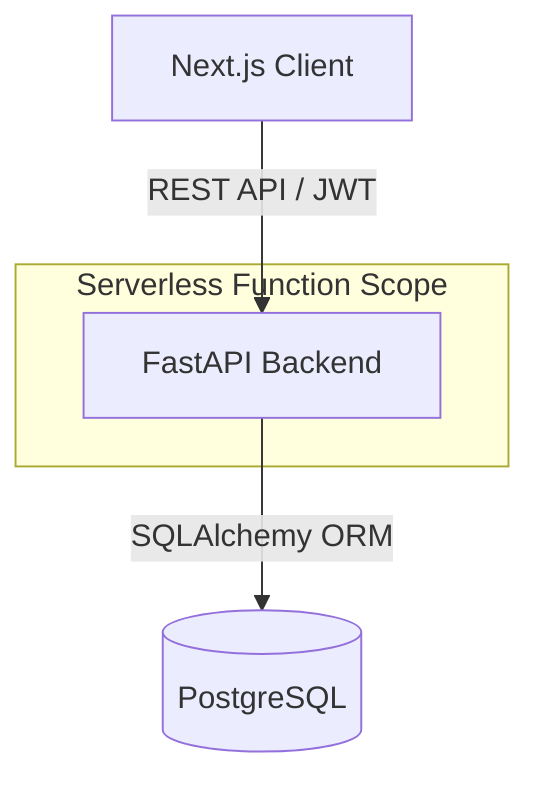

# Dayflow HRMS

**The modern, lightweight HR operating system for fast-moving teams.**

---

## 🚀 Why Dayflow?

Small to medium-sized teams face a dilemma: manage HR via scattered spreadsheets and email threads, or adopt bloated, expensive enterprise suites like Workday or BambooHR. The former is chaotic and error-prone; the latter is slow, complex, and overkill.

**Dayflow bridges this gap.** We focused on the 20% of features that drive 80% of HR operations—attendance, leave, and payroll visibility—and polished them to perfection. It eliminates the friction of "HR Admin" tasks, replacing clunky forms with a unified, real-time interface that employees genuinely enjoy using.

---

## 💡 Solution Overview

Dayflow is a unified Human Resource Management System (HRMS) designed for clarity and speed. It serves two distinct personas with a single, cohesive codebase:

*   **Employees**: Check in/out with one tap, view payroll history, and apply for leave with instant status visibility.
*   **Admins**: Manage workforce data, approve requests, and monitor daily attendance from a high-level dashboard.

**Core Differentiator**: While competitors focus on feature density, Dayflow prioritizes **Developer Experience (DX)** and **User Experience (UX)**. The architecture is built for serverless scale, and the UI is built for "flow state"—minimal clicks, subtle motion, and zero latency.

---

## ✨ Key Features

### 🛡️ Secure Role-Based Access (RBAC)
*   Strict separation between **Admin** and **Employee** roles.
*   JWT-based stateless authentication ensures secure, scalable session management.

### ⏱️ Attendance Tracking
*   **One-tap Check-in/Check-out**: Intelligent status calculation (Present vs. Half-day based on duration).
*   **Visual History**: Calendar-view verification of work hours and status.

### 🏝️ Leave Management
*   **Streamlined Applications**: Date validation and overlap checking built-in.
*   **Approval Workflow**: Admins review requests with context; employees receive real-time status updates (Approved/Rejected/Pending).

### 🔔 In-App Notifications
*   **Contextual Alerts**: Real-time feedback for leave approvals and system updates.
*   **Action-Oriented**: Notifications link directly to relevant entities.

### 💰 Payroll Visibility
*   **Transparency**: Employees access salary structures, allowances, and deductions securely.

### 🎨 Enterprise-Grade UI/UX
*   **Calm Aesthetics**: Clean typography and purposeful whitespace reduce cognitive load.
*   **Motion Design**: Framer Motion powers layout transitions that provide spatial context, not distraction.

---

## 🏗️ Architecture Overview

Dayflow follows a modern **Monorepo-style** architecture designed for Vercel deployment, treating the backend as a first-class citizen alongside the frontend.



*   **Stateless Backend**: The FastAPI service is designed to be fully stateless, making it ideal for serverless environments (like Vercel Functions) where cold starts and scaling are managed automatically.
*   **Type Safety**: TypeScript on the frontend and Pydantic on the backend ensures strong data contracts, reducing runtime errors.
*   **Database**: A relational schema (PostgreSQL) rigorously enforces data integrity for critical HR records (users, attendance, payroll).

---

## 🛠️ Tech Stack

### Frontend
*   **Framework**: **Next.js 14** (App Router) – For server-side rendering, routing stability, and Vercel optimization.
*   **UI Library**: **React** + **shadcn/ui** + **Tailwind CSS** – Accelerates development while maintaining complete customization control.
*   **Animation**: **Framer Motion** – Delivers "app-like" fluidity on the web.

### Backend
*   **Framework**: **FastAPI** (Python) – Chosen for performance, auto-generated documentation (Swagger UI), and native async support.
*   **ORM**: **SQLAlchemy** – Provides robust SQL abstraction and safe database mutations.
*   **Validation**: **Pydantic** – Enforces strict schema validation for all API inputs and outputs.

### Infrastructure
*   **Database**: **PostgreSQL** – The industry standard for relational data integrity.
*   **Deployment**: **Vercel** – Extracts complexity from CI/CD, hosting both the Next.js frontend and Python API in a single workflow.

---

## 🧩 System Design Highlights

1.  **Schema-First Design**: Database models (SQLAlchemy) and API schemas (Pydantic) are strictly typed. We do not rely on "loose" JSON objects; every payload is validated at the edge.
2.  **Modular Backend Structure**: The API is structured to separate Routes, Services (Business Logic), and Models, preventing the "massive controller" anti-pattern.
3.  **Event-Driven Notification Logic**: System actions (like Leave Approval) trigger decoupled notification events, ensuring that user feedback loops are closed without tightly coupling modules.
4.  **Vercel-Compatible**: The backend avoids local file interactions or long-running processes, adhering precisely to serverless execution limits.

---

## 📂 Project Structure

A clean separation of concerns ensures maintainability and scalability.

```text
Dayflow/
├── app/                  # Next.js App Router (Frontend Pages)
│   ├── (auth)/           # Login & Signup routes
│   ├── admin/            # Admin-protected dashboard & views
│   └── employee/         # Employee-specific dashboard & views
├── components/           # Reusable UI components (shadcn/ui)
├── lib/                  # Frontend utilities & API clients
│   └── api.ts            # Strongly-typed API client wrapper
├── api/                  # FastAPI Backend Source
│   ├── index.py          # Application entry point & routes
│   ├── models.py         # SQLAlchemy Database Models
│   └── schemas.py        # Pydantic Data Schemas
├── alembic/              # Database migrations
└── requirements.txt      # Python dependencies
```

---

## 🔌 API Design (High Level)

Our API follows strictly restful principles, with consistent resource naming and HTTP verbs.

| Resource | Methods | Description |
| :--- | :--- | :--- |
| `/auth` | `POST` | Signup, Login, Profile Creation |
| `/attendance` | `POST`, `GET` | Check-in, Check-out, History retrieval |
| `/leave` | `POST`, `GET`, `PUT` | Apply, List (User/All), Approve/Reject (`PUT`) |
| `/notifications` | `GET`, `POST` | List user alerts, Mark as read |
| `/profile` | `GET`, `PUT` | User profile management |

*Note: All protected endpoints require a valid `Bearer` token in the Authorization header.*

---

## 🎨 UI/UX Philosophy

We rejected the "drab enterprise software" aesthetic. Dayflow is built on the principle that internal tools should feel as premium as consumer products.

*   **Calmness**: We use a refined palette (Slate, Emerald, Indigo) to convey stability.
*   **Feedback**: Every action (save, submit, error) provides instant feedback via toast notifications.
*   **Motion**: Transition animations aren't just for show—they guide the user's eye, explaining where data is coming from and where it is going.

---

## 🎞️ Demo Walkthrough

### 1. The Leave Flow
*   **Employee** logs in and navigates to "Leaves".
*   Fills out a date range; the specific duration is auto-calculated.
*   **Admin** receives the request on their dashboard.
*   Admin approves the request with a comment.
*   **Employee** dashboard instantly reflects the "Approved" status and decrement in leave balance.

### 2. The Attendance Loop
*   Employee logs in at 9:00 AM → Dashboard shows "Good Morning" + "Check In".
*   Clicks "Check In" → System records timestamp.
*   Logs out at 6:00 PM → Dashboard shows "Check Out" + "Present" status is finalized.

---

## 🚀 Deployment

The entire stack is deployed on **Vercel**.

1.  **Frontend**: Static assets and Server Components served via Vercel Edge Network.
2.  **Backend**: `api/index.py` is detected by Vercel's Python runtime and deployed as a Serverless Function.
3.  **Database**: Connected via secure environment variables to a cloud-hosted PostgreSQL instance.

---

## 🛑 What We Deliberately Did NOT Build

Scope discipline is a feature. To ensure the highest quality for the hackathon, we explicitly excluded:

*   **Complex Tax/Payroll Engine**: We model payroll *visibility*, but tax calculation is a massive domain best left to dedicated APIs.
*   **Email Services**: We focused on *in-app* notifications to keep the demo self-contained and fast.
*   **Mobile App**: The web app is fully responsive, negating the immediate need for a native app.
*   **Multi-tenancy**: Dayflow is currently designed for a single organization to maximize depth in core features.

---

## 🔮 Future Enhancements

*   **Advanced Analytics**: Visualizing turnover rates, attendance trends, and department heatmaps.
*   **Payslip Generation**: PDF generation for monthly payroll records.
*   **WebSockets**: Upgrading notifications from polling to true push events.
*   **Dark Mode**: Expanding the design system to support theming.

---

## 🏗️ Engineering Principles

1.  **Reliability Over Features**: A bug-free login and attendance flow is worth more than 10 half-baked features.
2.  **Security by Default**: Passwords are hashed (bcrypt), APIs are guarded (JWT dependency injection), and inputs are sanitized (Pydantic).
3.  **Separation of Concerns**: The frontend knows nothing about the database; the backend knows nothing about the UI. They meet strictly at the API contract.

---

## 👨‍💻 Hackathon Notes

Dayflow was built with a production mindset under hackathon constraints. We prioritized **code cleanliness** and **architectural validity** over hacking together features that would fall apart in a real deployment. Every line of code—from the database models to the framer motion variants—was written to be readable, maintainable, and impressive.